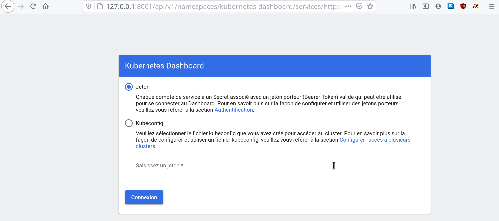

# Installing the Environment

> Note: This doc is written in February 2021. Therefore you should check the
> links to download softwares because the links might be outdated by the time 
> you read this doc.

> Note: This doc is under contruction.

**For the best experience, please read the entire page before installing**
**anything.** Then follow the steps to setup your environment.

<!-- Install doctoc with `npm install -g doctoc`  then `doctoc --gitlab  --notitle  install-environment.md` -->

<!-- START doctoc generated TOC please keep comment here to allow auto update -->
<!-- DON'T EDIT THIS SECTION, INSTEAD RE-RUN doctoc TO UPDATE -->

- [Hardware Prerequites](#hardware-prerequites)
- [Installing Kubernetes Kind](#installing-kubernetes-kind)
    - [Step 1: Install golang](#step-1-install-golang)
    - [Step 2: Installing Docker](#step-2-installing-docker)
    - [Step 3: Install Kubernetes Kind.](#step-3-install-kubernetes-kind)
- [Install `kubectl`](#install-kubectl)
- [Installing HELM](#installing-helm)
- [Installing Istio along with Kind](#installing-istio-along-with-kind)
- [Installing Keycloak Operator onto K8s kind](#installing-keycloak-operator-onto-k8s-kind)
- [Installing kubernetes Ingress on k8s kind](#installing-kubernetes-ingress-on-k8s-kind)
- [Configuring kubernetes Ingress to expose Keycloak GUI](#configuring-kubernetes-ingress-to-expose-keycloak-gui)
- [[Optional] Installing a dashboard for your Kubernetes environment](#optional-installing-a-dashboard-for-your-kubernetes-environment)
    - [How to expose your Kubernetes dashboard with K8S Ingress](#how-to-expose-your-kubernetes-dashboard-with-k8s-ingress)
    - [How to access your Kubernetes Dashboard trough SSH?](#how-to-access-your-kubernetes-dashboard-trough-ssh)

<!-- END doctoc generated TOC please keep comment here to allow auto update -->


## Hardware Prerequites

We assume you will install this environment on a virtual rather than on your
desktop/laptop PC.

4Gb of RAM and 4 vCPU should be enough. Storage capacity required is low.


## Installing Kubernetes Kind

Kind stands for **K**ubernetes **in** **D**ocker.

First you should read the instructions of the
[Kubernetes Kind official doc](https://kind.sigs.k8s.io/). In the sections
below, we add some details and tips.

**But we might not detail the steps as much as in the official**
**documentation.** Please be aware of that.


### Step 1: Install golang

Before installing Kubernetes Kind, you must install `golang`.
Follow this procedure: https://golang.org/doc/install .

Extract of the procedure:

```bash
$ wget https://golang.org/dl/go1.15.8.linux-amd64.tar.gz
$ tar -C /usr/local -xzf go1.15.8.linux-amd64.tar.gz
$ export PATH=$PATH:/usr/local/go/bin
```

Verify the installation of `golang`:

```bash
$ go version

# result
go version go1.15.8 linux/amd64
```

Your installation of `golang` seems to be successful. Proceed with the
installation of docker.


### Step 2: Installing Docker

Before installing Kubernetes Kind, you must install `docker`.

`docker` usually uses the following IP address range for its default
virtual bridge: `172.16.x.x`. To avoid conflict with your own network
topology, you can customize your `docker` installation **BEFORE** instaling
`docker`.

Customize your docker installation:

* [dockerd daemon configuration](https://docs.docker.com/engine/reference/commandline/dockerd/)
* https://serverfault.com/questions/916941/configuring-docker-to-not-use-the-172-17-0-0-range

For example, use this dockerd daemon configuration:

```bash
$ sudo su
$ mkdir /etc/docker
$ cd /etc/docker
$ touch daemon.json

$ cat <<EOF > /etc/docker/daemon.json
{
  "bip": "10.200.0.1/24",
  "default-address-pools":[
    {"base":"10.201.0.0/16","size":24},
    {"base":"10.202.0.0/16","size":24},
    {"base":"10.203.0.0/16","size":24},
    {"base":"10.204.0.0/16","size":24},
    {"base":"10.205.0.0/16","size":24}
  ],
  "default-gateway": "",
  "default-gateway-v6": "",
  "dns": [
    "1.1.1.1"
    ],
  "dns-opts": [
    "8.8.8.8",
    "8.8.4.4"
  ],
  "dns-search": [
    "yourdomain.net"
  ],
  "selinux-enabled": false
}
EOF
```

Then, follow this to install `docker` for Ubuntu:
https://docs.docker.com/engine/install/ubuntu/.

> Note: If you are using an other linux distro, please use the dedicated
> instructions.


Then, you should follow
[those post install steps](https://docs.docker.com/engine/install/linux-postinstall/)
to add your current user to the `docker` group.

```bash
$ sudo groupadd docker
$ sudo usermod -aG docker $USER
```

Then you should exit your terminal and reconnect to it. Then check the
installation:

```bash
$ docker version

Client: Docker Engine - Community
 Version:           20.10.3
 API version:       1.41
 Go version:        go1.13.15
 Git commit:        48d30b5
 Built:             Fri Jan 29 14:33:21 2021
 OS/Arch:           linux/amd64
 Context:           default
 Experimental:      true

Server: Docker Engine - Community
 Engine:
  Version:          20.10.3
  API version:      1.41 (minimum version 1.12)
  Go version:       go1.13.15
  Git commit:       46229ca
  Built:            Fri Jan 29 14:31:32 2021
  OS/Arch:          linux/amd64
  Experimental:     false
 containerd:
  Version:          1.4.3
  GitCommit:        269548fa27e0089a8b8278fc4fc781d7f65a939b
 runc:
  Version:          1.0.0-rc92
  GitCommit:        ff819c7e9184c13b7c2607fe6c30ae19403a7aff
 docker-init:
  Version:          0.19.0
  GitCommit:        de40ad0
```


Some additionnal steps:

```bash
$ sudo systemctl enable docker.service
$ sudo systemctl enable containerd.service
```

Your docker installation seems fine. Proceed with the installation of K8s Kind.


### Step 3: Install Kubernetes Kind.

Following [the doc](https://kind.sigs.k8s.io/docs/user/quick-start/):

Notice the PATH `/usr/local/go/bin`. You can modify it here:

```bash
$ sudo vim /etc/environment
```

Now proceed with the following steps:

```bash
# Make sure go is reachable in your PATH
$ echo $PATH
/usr/local/sbin:/usr/local/bin:/usr/sbin:/usr/bin:/sbin:/bin:/usr/games:/usr/local/games:/snap/bin:/usr/local/go/bin

$ go version
go version go1.15.8 linux/amd64

# Make sure docker is running
$ docker version
Client: Docker Engine - Community
 Version:           20.10.3
 API version:       1.41
[...] lines truncated [...]

# Install K8s Kind
$ GO111MODULE="on" go get sigs.k8s.io/kind@v0.10.0
go: downloading sigs.k8s.io/kind v0.10.0
go: downloading github.com/pkg/errors v0.9.1
go: downloading k8s.io/apimachinery v0.19.2
go: downloading github.com/spf13/pflag v1.0.5
go: downloading github.com/mattn/go-isatty v0.0.12
go: downloading github.com/alessio/shellescape v1.2.2
go: downloading github.com/pelletier/go-toml v1.8.1
go: downloading github.com/evanphx/json-patch v4.9.0+incompatible
go: downloading github.com/BurntSushi/toml v0.3.1
go: downloading gopkg.in/yaml.v3 v3.0.0-20200615113413-eeeca48fe776
go: downloading github.com/spf13/cobra v1.0.0
go: downloading golang.org/x/sys v0.0.0-20200928205150-006507a75852
go: downloading sigs.k8s.io/yaml v1.2.0
go: downloading github.com/evanphx/json-patch/v5 v5.1.0
go: downloading gopkg.in/yaml.v2 v2.2.8
go: downloading github.com/inconshreveable/mousetrap v1.0.0

# Move the Kind CLI to your PATH
$ sudo mv $(go env GOPATH)/bin/kind /usr/local/bin/
```

**Kind is now installed.** Verify this install:

```bash
$ kind version
kind v0.10.0 go1.15.8 linux/amd64
```


## Install `kubectl`

You should following this:
https://kubernetes.io/fr/docs/tasks/tools/install-kubectl/ .

Extract:

```bash
$ curl -LO https://storage.googleapis.com/kubernetes-release/release/$(curl -s https://storage.googleapis.com/kubernetes-release/release/stable.txt)/bin/linux/amd64/kubectl

$ chmod +x ./kubectl

$ sudo mv ./kubectl /usr/local/bin/kubectl

$ kubectl version --client
Client Version: version.Info{Major:"1", Minor:"20", GitVersion:"v1.20.2", GitCommit:"faecb196815e248d3ecfb03c680a4507229c2a56", GitTreeState:"clean", BuildDate:"2021-01-133:28:09Z", GoVersion:"go1.15.5", Compiler:"gc", Platform:"linux/amd64"}
```

The kubectl CLI is installed.

TODO: add tips about Kubeconfig file and kubectl and the kind CLI.


## Installing HELM

[HELM](https://helm.sh/) can be usefull for our deployements.

Check out this june 2020 blog post
[Local Kubernetes with kind, Helm & Dashboard](https://medium.com/@munza/local-kubernetes-with-kind-helm-dashboard-41152e4b3b3d).

Then, follow this doc to install HELM: https://helm.sh/docs/intro/install/.

> Note: You can also install HELM thanks to Package Managers:
> https://helm.sh/docs/intro/install/#through-package-managers


Select the version you want (I take the latest stable available):

```bash
$ wget https://get.helm.sh/helm-v3.5.2-linux-amd64.tar.gz

$ tar -zxvf helm-v3.5.2-linux-amd64.tar.gz 
linux-amd64/
linux-amd64/helm
linux-amd64/LICENSE
linux-amd64/README.md

$ sudo mv linux-amd64/helm /usr/local/bin/helm
```

> Alternative helm installation:
>
> ```bash
> $ curl -fsSL -o get_helm.sh https://raw.githubusercontent.com/helm/helm/master/scripts/get-helm-3
> $ chmod 700 get_helm.sh
> $ ./get_helm.sh
>
> # result
> Downloading https://get.helm.sh/helm-v3.5.2-linux-amd64.tar.gz
> Verifying checksum... Done.
> Preparing to install helm into /usr/local/bin
> helm installed into /usr/local/bin/helm
> ```

Check the version of HELM:

```bash
$ helm version
version.BuildInfo{Version:"v3.5.2", GitCommit:"167aac70832d3a384f65f9745335e9fb40169dc2", GitTreeState:"dirty", GoVersion:"go1.15.7"}
```

Then follow this:
https://helm.sh/docs/intro/quickstart/#initialize-a-helm-chart-repository .

```bash
$ helm repo add stable https://charts.helm.sh/stable
"stable" has been added to your repositories

$ helm search repo stable
NAME                                 	CHART VERSION	APP VERSION            	DESCRIPTION                                       
stable/acs-engine-autoscaler         	2.2.2        	2.1.1                  	DEPRECATED Scales worker nodes within agent pools 
stable/aerospike                     	0.3.5        	v4.5.0.5               	DEPRECATED A Helm chart for Aerospike in Kubern...
stable/airflow                       	7.13.3       	1.10.12                	DEPRECATED - please use: https://github.com/air...
stable/ambassador                    	5.3.2        	0.86.1                 	DEPRECATED A Helm chart for Datawire Ambassador   
[...lines are omitted...]
```


## Installing Istio along with Kind

Follow the steps here to install Istio along with Kind:
https://istio.io/latest/docs/setup/platform-setup/kind/.

TODO: Improve the `$ kind create cluster` command with a custom configuration:
https://kind.sigs.k8s.io/docs/user/quick-start/#advanced

First, we need to create a K8s Kind cluster.

You will need to expose some ports for the dashboards, Keyclaok, etc... that
will be running on your K8s Kind cluster.

Check the K8s [Kind documentation about Ingress](https://kind.sigs.k8s.io/docs/user/ingress/#ingress-nginx).

Customize your K8s Kind cluster before creating it: create a file
`istio-testing-cluster.yaml`.
[TODO: add workers/compute nodes to differentiate from control-plane nodes?]

```yaml
# File istio-testing-cluster.yaml
kind: Cluster
apiVersion: kind.x-k8s.io/v1alpha4
nodes:
- role: control-plane
  kubeadmConfigPatches:
  - |
    kind: InitConfiguration
    nodeRegistration:
      kubeletExtraArgs:
        node-labels: "ingress-ready=true"
  extraPortMappings:
  - containerPort: 80
    hostPort: 80
    protocol: TCP
  - containerPort: 443
    hostPort: 443
    protocol: TCP
  - containerPort: 8002
    hostPort: 8002
    protocol: TCP
  - containerPort: 8003
    hostPort: 8003
    protocol: TCP
  - containerPort: 8080
    hostPort: 8080
    protocol: TCP
  - containerPort: 8081
    hostPort: 8081
    protocol: TCP
  - containerPort: 8082
    hostPort: 8082
    protocol: TCP
  - containerPort: 8443
    hostPort: 8443
    protocol: TCP
```

As you can see, we do some `extraPortMappings` for some ports that we might
need to expose.


```bash
$ kind create cluster --name istio-testing --config istio-testing-cluster.yaml
Creating cluster "istio-testing" ...
 ✓ Ensuring node image (kindest/node:v1.20.2) 🖼 
 ✓ Preparing nodes 📦  
 ✓ Writing configuration 📜 
 ✓ Starting control-plane 🕹️ 
 ✓ Installing CNI 🔌 
 ✓ Installing StorageClass 💾 
Set kubectl context to "kind-istio-testing"
You can now use your cluster with:

kubectl cluster-info --context kind-istio-testing

Not sure what to do next? 😅  Check out https://kind.sigs.k8s.io/docs/user/quick-start/
```

```bash
$ kubectl config get-contexts
CURRENT   NAME                 CLUSTER              AUTHINFO             NAMESPACE
*         kind-istio-testing   kind-istio-testing   kind-istio-testing
```

```bash
$ kubectl cluster-info --context kind-istio-testing
Kubernetes control plane is running at https://127.0.0.1:44955
KubeDNS is running at https://127.0.0.1:44955/api/v1/namespaces/kube-system/services/kube-dns:dns/proxy

$ kubectl get nodes
NAME                          STATUS   ROLES                  AGE   VERSION
istio-testing-control-plane   Ready    control-plane,master   15m   v1.20.2
```

```bash
$ kubectl config use-context kind-istio-testing
Switched to context "kind-istio-testing".
```

Then you shloud follow Istio doc:
https://istio.io/latest/docs/setup/getting-started/#download .

You should move the `istio-1.9.0/bin/istioctl` binary to `/usr/local/bin/`.
If you do that, you do not need to do `export PATH=$PWD/bin:$PATH`.

```bash
$ sudo cp istio-1.9.0/bin/istioctl /usr/local/bin/
```

Check the version of Istio:

```bash
$ istioctl version
no running Istio pods in "istio-system"
1.9.0
```

Then proceed with the creation of your Istio service mesh control plane
within your newly create `istio-testing` K8s kind cluster:
https://istio.io/latest/docs/setup/getting-started/#install .

```bash
$ istioctl install --set profile=demo -y
✔ Istio core installed
✔ Istiod installed
✔ Egress gateways installed
✔ Ingress gateways installed
✔ Installation complete 
```


## Installing Keycloak Operator onto K8s kind

First, you should go through this Keycloak Operator official doc,
**but follow the Kubernetes procedure** and do not follow the OpenShift
procedure:
https://www.keycloak.org/docs/latest/server_installation/index.html#_operator

Then, continue with reading
[Installation on a Kubernetes cluster](https://www.keycloak.org/docs/latest/server_installation/index.html#_kubernetes-olm)

This is what you should see when installing the OLM (operator lifecycle
manager):

```bash
$ curl -sL https://github.com/operator-framework/operator-lifecycle-manager/releases/download/v0.17.0/install.sh | bash -s v0.17.0

customresourcedefinition.apiextensions.k8s.io/catalogsources.operators.coreos.com created
customresourcedefinition.apiextensions.k8s.io/clusterserviceversions.operators.coreos.com created
customresourcedefinition.apiextensions.k8s.io/installplans.operators.coreos.com created
customresourcedefinition.apiextensions.k8s.io/operatorgroups.operators.coreos.com created
customresourcedefinition.apiextensions.k8s.io/operators.operators.coreos.com created
customresourcedefinition.apiextensions.k8s.io/subscriptions.operators.coreos.com created
customresourcedefinition.apiextensions.k8s.io/catalogsources.operators.coreos.com condition met
customresourcedefinition.apiextensions.k8s.io/clusterserviceversions.operators.coreos.com condition met
customresourcedefinition.apiextensions.k8s.io/installplans.operators.coreos.com condition met
customresourcedefinition.apiextensions.k8s.io/operatorgroups.operators.coreos.com condition met
customresourcedefinition.apiextensions.k8s.io/operators.operators.coreos.com condition met
customresourcedefinition.apiextensions.k8s.io/subscriptions.operators.coreos.com condition met
namespace/olm created
namespace/operators created
serviceaccount/olm-operator-serviceaccount created
clusterrole.rbac.authorization.k8s.io/system:controller:operator-lifecycle-manager created
clusterrolebinding.rbac.authorization.k8s.io/olm-operator-binding-olm created
deployment.apps/olm-operator created
deployment.apps/catalog-operator created
clusterrole.rbac.authorization.k8s.io/aggregate-olm-edit created
clusterrole.rbac.authorization.k8s.io/aggregate-olm-view created
operatorgroup.operators.coreos.com/global-operators created
operatorgroup.operators.coreos.com/olm-operators created
clusterserviceversion.operators.coreos.com/packageserver created
catalogsource.operators.coreos.com/operatorhubio-catalog created
Waiting for deployment "olm-operator" rollout to finish: 0 of 1 updated replicas are available...
deployment "olm-operator" successfully rolled out
Waiting for deployment "catalog-operator" rollout to finish: 0 of 1 updated replicas are available...
deployment "catalog-operator" successfully rolled out
Package server phase: Installing
Package server phase: Succeeded
deployment "packageserver" successfully rolled out
```

But before doing "step 2" of the below screenshot, you should customize your
`keycloak-operator.yaml` install file.


For example, we change the namespace name for our Keycloak instance.

```bash
$ wget https://operatorhub.io/install/keycloak-operator.yaml
```

```yaml
# File keycloak-operator.yaml
apiVersion: v1
kind: Namespace
metadata:
  name: keycloak-tp
---
apiVersion: operators.coreos.com/v1
kind: OperatorGroup
metadata:
  name: operatorgroup
  namespace: keycloak-tp
spec:
  targetNamespaces:
  - keycloak-tp
---
apiVersion: operators.coreos.com/v1alpha1
kind: Subscription
metadata:
  name: my-keycloak-operator
  namespace: keycloak-tp
spec:
  channel: alpha
  name: keycloak-operator
  source: operatorhubio-catalog
  sourceNamespace: olm
```

Once your Keycloak Operator file is ready, proceed with the instanciation
of the Keyclaok operator pod and custom ressource:

```bash
$ kubectl create -f keycloak/keycloak-operator.yaml 
namespace/keycloak-tp created
operatorgroup.operators.coreos.com/operatorgroup created
subscription.operators.coreos.com/my-keycloak-operator created
```

One pod should appear in the `keycloak-tp` namespace:

```bash
$ kubectl get pods -n keycloak-tp
NAME                                 READY   STATUS    RESTARTS   AGE
keycloak-operator-5c5d6b657b-s82cg   1/1     Running   0          46s
```

Then, create a YAML file `keycloak.yaml` for a Keycloak custom resource.
**Be sure to create the Keycloak instance in the SAME namespace where the**
**kubernetes operator for keycloak is installed.**

```yaml
# file keycloak.yaml
apiVersion: keycloak.org/v1alpha1
kind: Keycloak
metadata:
  name: example-keycloak
  namespace: keycloak-tp
  labels:
   app: example-keycloak
spec:
  instances: 1
  externalAccess:
    enabled: True
```

Create the resource:

```bash
$ kubectl apply -f keycloak/keycloak.yaml -n keycloak-tp
keycloak.keycloak.org/example-keycloak created
```

You should see new pods:

```bash
$ kubectl get pods -n keycloak-tp
NAME                                   READY   STATUS              RESTARTS   AGE
keycloak-0                             0/1     Init:0/1            0          31s
keycloak-operator-5c5d6b657b-s82cg     1/1     Running             0          4m3s
keycloak-postgresql-6b5d8c7c88-qgq56   0/1     ContainerCreating   0          32s
```

After some times, the pods should be ready:

```bash
$ kubectl get pods -n keycloak-tp
NAME                                   READY   STATUS    RESTARTS   AGE
keycloak-0                             0/1     Running   0          4m
keycloak-operator-5c5d6b657b-s82cg     1/1     Running   0          7m32s
keycloak-postgresql-6b5d8c7c88-qgq56   1/1     Running   0          4m1s
```

Now check which ports are used: you should see 8080 and 8443.
Now remember that you bind those port during `kind create cluster`.

```bash
$ kubectl get svc -n keycloak-tp
NAME                        TYPE        CLUSTER-IP      EXTERNAL-IP   PORT(S)             AGE
keycloak                    ClusterIP   10.96.177.226   <none>        8443/TCP            4m47s
keycloak-discovery          ClusterIP   None            <none>        8080/TCP            4m47s
keycloak-operator-metrics   ClusterIP   10.96.23.78     <none>        8383/TCP,8686/TCP   8m9s
keycloak-postgresql         ClusterIP   10.96.127.13    <none>        5432/TCP            4m47s
```

However, those port are not exposed on your host yet.
You need to configure the K8s Kind Ingress.


## Installing kubernetes Ingress on k8s kind

TODO: Answer the question *"Is it relevant to deploy Keycloak behind an Istio 
gateway?"* instead of using kubernetesIngress?

First read this(be aware some API are deprecated in this doc):
https://kind.sigs.k8s.io/docs/user/ingress/#ingress-nginx

K8s Kind only binds one port out of the box. It is not enough.

Then check out kubernetes/ingress-nginx, which is a solution:
https://github.com/kubernetes/ingress-nginx

Install kubernetes/ingress-nginx on your k8s Kind cluster:

```bash
$ kubectl apply -f https://raw.githubusercontent.com/kubernetes/ingress-nginx/master/deploy/static/provider/kind/deploy.yaml
namespace/ingress-nginx created
serviceaccount/ingress-nginx created
configmap/ingress-nginx-controller created
clusterrole.rbac.authorization.k8s.io/ingress-nginx created
clusterrolebinding.rbac.authorization.k8s.io/ingress-nginx created
role.rbac.authorization.k8s.io/ingress-nginx created
rolebinding.rbac.authorization.k8s.io/ingress-nginx created
service/ingress-nginx-controller-admission created
service/ingress-nginx-controller created
deployment.apps/ingress-nginx-controller created
validatingwebhookconfiguration.admissionregistration.k8s.io/ingress-nginx-admission created
serviceaccount/ingress-nginx-admission created
clusterrole.rbac.authorization.k8s.io/ingress-nginx-admission created
clusterrolebinding.rbac.authorization.k8s.io/ingress-nginx-admission created
role.rbac.authorization.k8s.io/ingress-nginx-admission created
rolebinding.rbac.authorization.k8s.io/ingress-nginx-admission created
job.batch/ingress-nginx-admission-create created
job.batch/ingress-nginx-admission-patch created
```

You should see something like this:

```bash
$ kubectl get services -n ingress-nginx
NAME                                 TYPE        CLUSTER-IP     EXTERNAL-IP   PORT(S)                      AGE
ingress-nginx-controller             NodePort    10.96.102.11   <none>        80:31007/TCP,443:30743/TCP   3m24s
ingress-nginx-controller-admission   ClusterIP   10.96.44.241   <none>        443/TCP                      3m24s


$ kubectl get nodes -o wide
NAME                          STATUS   ROLES                  AGE   VERSION   INTERNAL-IP   EXTERNAL-IP   OS-IMAGE       KERNEL-VERSION     CONTAINER-RUNTIME
istio-testing-control-plane   Ready    control-plane,master   80m   v1.20.2   172.17.0.2    <none>        Ubuntu 20.10   5.8.0-43-generic   containerd://1.4.0-106-gce4439a8
```

Now that the K8s kind/docker ports are bound to the VM host, you can expose
keycloak WEB GUI.


## Configuring kubernetes Ingress to expose Keycloak GUI

As some API are deprecated in k8s kind doc:

```bash
Warning: networking.k8s.io/v1beta1 Ingress is deprecated in v1.19+, unavailable in v1.22+; use networking.k8s.io/v1 Ingress
ingress.networking.k8s.io/example-ingress configured
```

We will improve the official doc and use `networking.k8s.io/v1` instead.

Create a file `keycloak-ingress.yaml` and apply it in the same namespace than
keycloak:

```yaml
# file keycloak-ingress.yaml
apiVersion: networking.k8s.io/v1
kind: Ingress
metadata:
  name: keycloak-ingress
  namespace: keycloak-tp
spec:
  rules:
  - http:
      paths:
      - path: /auth
        pathType: Prefix
        backend:
          service:
            name: keycloak-discovery 
            port:
              number: 8080
      - path: /keycloak
        pathType: Prefix
        backend:
          service:
            name: keycloak-discovery 
            port:
              number: 8080
      - path: /auth
        pathType: Prefix
        backend:
          service:
            name: keycloak
            port:
              number: 8443
      - path: /keycloak
        pathType: Prefix
        backend:
          service:
            name: keycloak
            port:
              number: 8443
```


```bash
$ kubectl apply -f keycloak/keycloak-ingress.yaml -n keycloak-tp
ingress.networking.k8s.io/keycloak-ingress created
```

From within the VM host (where your K8s kind cluster is running), you can now
access to the keycloak WEB GUI (http or https):

```bash
# You are on the VM
$ curl -sI http://localhost/auth/admin/master/console/ | grep HTTP/
HTTP/1.1 200 OK

# You are on the VM
$ curl -sI -k https://localhost/auth/admin/master/console/ | grep HTTP/
HTTP/2 200
```

You can either use `localhost` or `127.0.0.1`. You can also use the IP address
of your cluster node:

```bash
$ kubectl get nodes -o wide
NAME                          STATUS   ROLES                  AGE    VERSION   INTERNAL-IP   EXTERNAL-IP   OS-IMAGE       KERNEL-VERSION     CONTAINER-RUNTIME
istio-testing-control-plane   Ready    control-plane,master   113m   v1.20.2   172.17.0.2    <none>        Ubuntu 20.10   5.8.0-43-generic   containerd://1.4.0-106-gce4439a8


$ curl -sI -k https://172.17.0.2/auth/admin/master/console/ | grep HTTP/
HTTP/2 200
```


Now if you want to open this WEB GUI on you local PC, you must do
SSH port forwarding: bind your local ports 18080 and 10443 to 80 and 443 on the
remote VM host.

Open a terminal and connect to the VM like that:

```bash
$ ssh  -L 18080:127.0.0.1:80  -L 10443:127.0.0.1:443  my-vm-name
```

Open a new terminal and try some curls (**add the ports**):

```bash
# You are on your desktop/laptop PC with SSH port forwarding
$ curl -sI http://localhost:18080/auth/admin/master/console/ | grep HTTP/ 
HTTP/1.1 200 OK

# You are on your desktop/laptop PC with SSH port forwarding
$ curl -sI -k https://localhost:10443/auth/admin/master/console/ | grep HTTP/
HTTP/2 200
```


Now get the login creadential to access the Keycloak WEB GUI console:

```bash
$ kubectl get secret  -n keycloak-tp credential-example-keycloak   -o go-template='{{range $k,$v := .data}}{{printf "%s: " $k}}{{if not $v}}{{$v}}{{else}}{{$v | base64decode}}{{end}}{{"\n"}}{{end}}'
ADMIN_PASSWORD: some_clear_password
ADMIN_USERNAME: admin
```

Now open the Keycloak WEB GUI console with a web browser:

```bash
# You are on your desktop/laptop PC with SSH port forwarding
firefox https://localhost:10443/auth/admin/master/console/
```

Now enter login:


Now you are good to go!


> Note: Later we would also use the K8s custom resource provided by the
> Keycloak Operator in order to configure Keycloak's realms, clients, users, 
> etc...
>
> This means we might not need the WEB console.
> See this doc:
> https://www.keycloak.org/docs/latest/server_installation/index.html#_realm-cr


## [Optional] Installing a dashboard for your Kubernetes environment

This step is optional, as you do not need a Kubernetes dashboard to operate
your cluster.

Check out this june 2020 blog post
[Local Kubernetes with kind, Helm & Dashboard](https://medium.com/@munza/local-kubernetes-with-kind-helm-dashboard-41152e4b3b3d).


### How to expose your Kubernetes dashboard with K8S Ingress

TODO: NOT WORKING for the moment.

```bash
$ kubectl get  svc -n kubernetes-dashboard
NAME                             TYPE        CLUSTER-IP     EXTERNAL-IP   PORT(S)   AGE
dashboard-kubernetes-dashboard   ClusterIP   10.96.78.232   <none>        443/TCP   78m
```


```yaml
# file kubernetes-dashboard-ingress.yaml
apiVersion: networking.k8s.io/v1
kind: Ingress
metadata:
  name: kubernetes-dashboard-ingress
  namespace: kubernetes-dashboard
spec:
  rules:
  - http:
      paths:
      - path: /
        pathType: Prefix
        backend:
          service:
            name: dashboard-kubernetes-dashboard
            port:
              number: 80
```

```bash
$ kubectl apply -n kubernetes-dashboard -f kubernetes-dashboard-ingress.yaml
ingress.networking.k8s.io/kubernetes-dashboard-ingress created
```


### How to access your Kubernetes Dashboard trough SSH?

TODO: NOT WORKING for the moment.


Lets assume you are accessing your cluster environment trough an SSH
connection.

On Linux, you might have configured your `.ssh/config` file like this:

```bash
Host my-vm-name
    Hostname random.hostname.org 
    User youruser
    Port 12345
    LogLevel INFO
    Compression yes
    IdentityFile /home/path/to/your/ssh/private/key.priv

```

Now, as suggested in the blog
[Local Kubernetes with kind, Helm & Dashboard](https://medium.com/@munza/local-kubernetes-with-kind-helm-dashboard-41152e4b3b3d), start
`$ kubectl proxy --port=8001`.

Now you can do some SSH port forwarding to access your cluster's network:

```bash
$ ssh -L 8001:127.0.0.1:8001 my-vm-name
```

Then enter the following URL:

```
http://127.0.0.1:8001/api/v1/namespaces/kubernetes-dashboard/services/https:dashboard-kubernetes-dashboard:https/proxy/#/login
```

You should see something like this:




Now follow the instruction to retrieve a token (jeton in french).

```bash
$ echo token=$(kubectl get secrets -o jsonpath="{.items[?(@.metadata.annotations['kubernetes\.io/service-account\.name']=='default')].data.token}"|base64 --decode)
token=eyJhbGciOiJ....
```

You should be able to login into to dashboard.


Vous devriez maintenant suivre les étapes
[ici pour la partie service-mesh](service-mesh.md).
